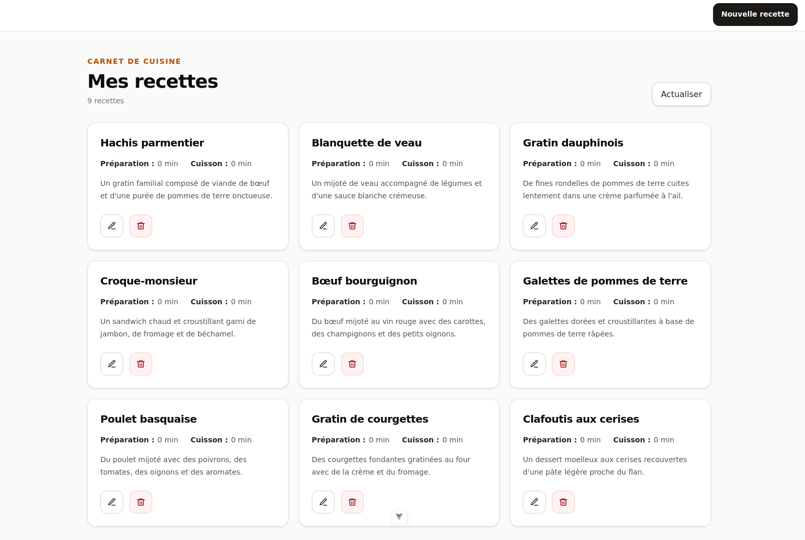

# Recipe Book — ASP.NET Core et Angular

Recipe Book est une application web full-stack pédagogique de gestion de recettes, construite avec ASP.NET Core, Entity Framework Core, SQLite et Angular. Elle permet de consulter, de créer, de modifier et de supprimer des recettes comprenant un nom, une description, un temps de préparation et un temps de cuisson.

Le backend repose sur une API REST développée avec ASP.NET Core et utilise Entity Framework Core pour enregistrer les recettes dans une base de données SQLite.

L’interface Angular utilise le client HTTP du framework pour communiquer avec l’API et assurer l’affichage et la gestion des recettes.



## Objectifs d'apprentissage

Ce projet sert de support pour pratiquer les bases d'une application web full-stack :

- structurer une API ASP.NET Core avec des controllers ;
- manipuler Entity Framework Core, les migrations et une base SQLite locale ;
- exposer des endpoints REST pour lire, créer, modifier et supprimer des données ;
- valider les données envoyées à l'API avec des attributs de validation ;
- créer une interface Angular avec des routes, des services HTTP et des formulaires réactifs ;
- connecter le frontend et le backend avec un proxy `/api` en développement.

## Fonctionnalités

- affichage de la liste des recettes ;
- création d'une recette avec nom, description, temps de préparation et temps de cuisson ;
- modification d'une recette existante ;
- suppression d'une recette depuis la liste ;
- validation des champs côté interface et côté API ;
- initialisation automatique de recettes de démonstration si la base est vide ;
- stockage local des données dans une base SQLite.

## Architecture

Le projet est organisé en deux applications :

- `api/` : API REST basée sur ASP.NET Core, Entity Framework Core et SQLite ;
- `frontend/` : interface Angular basée sur Angular Router, le client HTTP du framework et les formulaires réactifs.

## Installation

### Prérequis

- SDK .NET 10 ;
- Node.js et npm.

### Backend

Les dépendances .NET sont restaurées automatiquement au premier démarrage de l'API.

### Frontend

Installer les dépendances du frontend :

```bash
cd frontend
npm install
```

## Démarrage

1. Lancer l'API ASP.NET Core :

   ```bash
   cd api
   dotnet run
   ```

   L'API sera disponible sur `http://localhost:5174/`.

   Au démarrage, l'application applique automatiquement les migrations Entity Framework Core
   et initialise des recettes de démonstration si la base est vide.

2. Dans un autre terminal, lancer l'application Angular :

   ```bash
   cd frontend
   npm start
   ```

L'application sera disponible sur `http://localhost:4200/`.
